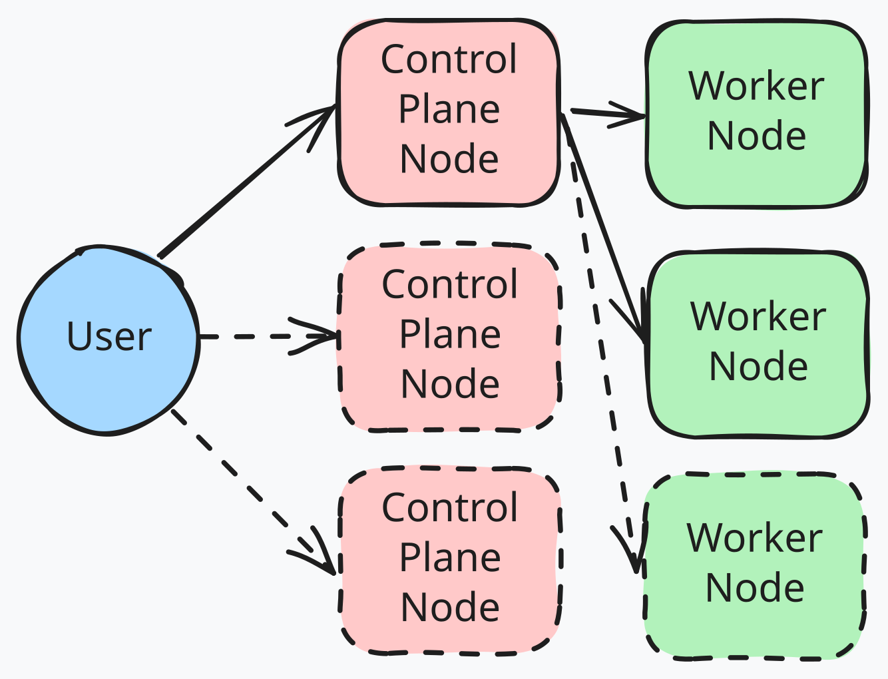

# Stack: Compute

The `compute` stack is our first stack to actually deploy something a little more tangible. The core compute platform for our little experiment is going to be [Kubernetes](https://kubernetes.io) (until I crack the shits with it and go back to [docker-compose](https://docs.docker.com/compose)) and our chosen method of running that (at least for now) is [Talos Linux](https://www.talos.dev).

## Prerequisites

The `foundation` stack must be applied prior to this stack.

## Kubernetes Cluster (Talos Linux)

Depending on the number of Proxmox nodes in the cluster, we will automagically deploy a kubernetes cluster with either one (if we have less than three Proxmox nodes) or three control plane nodes as well as a worker node per Proxmox node. In my environment, as I only have two Proxmox nodes, I will wind up with a single control plane node and two worker nodes.



Once the deployment is complete, you can configure your local `talosctl` and `kubectl` by running the below commands. Note that if you use either of these tools already, this will clobber existing settings. If you don't want that to happen, figure it out yourself.

```bash
# Write the Talos CLI config to your home directory
mkdir -p ~/.talos && terraform output -raw talosconfig > ~/.talos/config

# Write the Kubernetes CLI config to your home directory
mkdir -p ~/.kube && terraform output -raw kubeconfig > ~/.kube/config
```

Honestly I didn't find the Talos CLI to be overly helpful. It seems much more helpful if you're actually running a development cluster locally on your machine. The Kubernetes CLI however is obviously fantastic! The first thing you should run is `kubectl get nodes` to check everything looks to be inline with what you expect - noting that it takes a couple of minutes for the cluster to become healthy after the virtual machines are provisioned.

Congratulations! 🥳 We're now the proud owners of a (possibly even highly available) Kubernetes cluster in our own home. 😱
